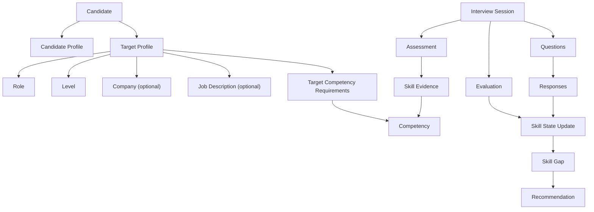
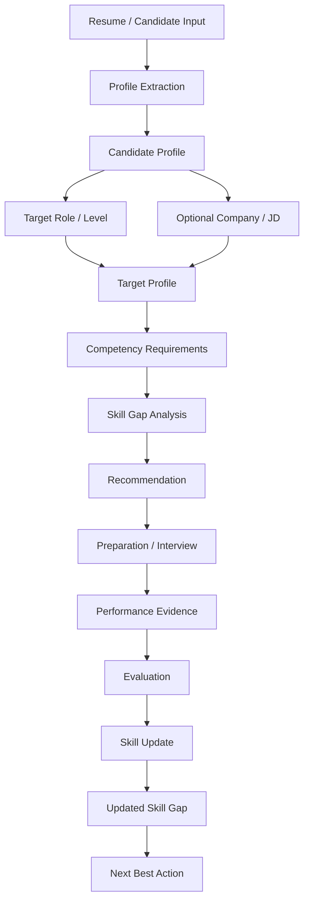
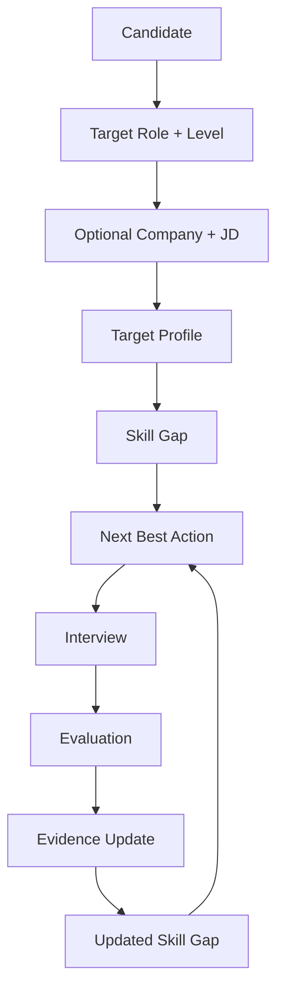

# Technical Requirements Document (TRD)

# CareerGraph AI

**Project:** Patchamomma 2026 Build Phase  
**Document:** Technical Requirements Document  
**Version:** 0.1  
**Status:** Draft  
**Related Document:** [Business Requirements Document](./BRD.md)

---

# 1. Technical Overview

CareerGraph AI is a cloud-native, data-driven, multi-agent AI application designed to help Software Engineering candidates evaluate interview readiness, identify skill gaps, receive personalized preparation recommendations, and continuously measure improvement.

The system will connect:

- Candidate profile data
- Resume information
- Target role and level
- Job description requirements
- Skill assessments
- Interview responses
- Interview evaluations
- Skill-gap information
- Preparation history
- Progress data

The technical architecture will use Google Cloud and Google AI technologies as the primary platform.

The MVP will prioritize:

- A focused multi-agent architecture
- Evidence-based AI evaluation
- Structured candidate and job data
- Continuous readiness updates
- Cost-aware AI inference
- Serverless deployment
- Secure handling of candidate information

---

# 2. Technical Goals

The technical implementation should achieve the following goals:

## 2.1 AI Intelligence

- Use Gemini for generative AI capabilities.
- Use structured outputs wherever possible.
- Ground recommendations in candidate and assessment data.
- Avoid relying on unexplained AI-generated scores.
- Provide evidence supporting important evaluations.

## 2.2 Agentic Architecture

- Use Google ADK for meaningful agent orchestration.
- Use a small number of agents with clearly defined responsibilities.
- Avoid creating separate agents for simple deterministic operations.
- Maintain clear boundaries between agents and application logic.

## 2.3 Data-Driven Architecture

- Store candidate state in structured form.
- Maintain historical assessment and interview data.
- Support skill-level performance tracking.
- Enable analytics over time.
- Separate transactional application data from analytical workloads where appropriate.

## 2.4 Cloud-Native Deployment

The MVP should be deployable using Google Cloud services.

The architecture should prefer:

- Serverless infrastructure where practical.
- Managed services.
- Minimal infrastructure administration.
- Secure secret management.
- Cost monitoring.

## 2.5 Cost Efficiency

The system should be designed for the Patchamomma Build Phase free credits.

The implementation should:

- Minimize unnecessary Gemini calls.
- Use appropriate models for different tasks.
- Reuse previously extracted information.
- Avoid sending unnecessary context to models.
- Limit interview-session length.
- Monitor cloud and AI usage.
- Support budget alerts.

---

# 3. MVP Technical Scope

The MVP will implement the following technical capabilities.

## 3.1 Candidate Profile

The system should allow a candidate to create and maintain:

- Basic profile information
- Education
- Experience
- Skills
- Projects
- Technologies
- Target role
- Target level
- Target company

---

## 3.2 Resume Processing

The system should:

1. Accept a resume document.
2. Store the original document securely.
3. Extract relevant candidate information.
4. Convert extracted information into structured data.
5. Validate the structured output.
6. Store the resulting candidate profile.

---

## 3.3 Job Description Processing

The system should:

1. Accept a target job description.
2. Extract relevant requirements.
3. Identify required and preferred skills.
4. Identify role-level expectations.
5. Convert the information into structured target requirements.
6. Store the resulting target profile.

---

## 3.4 Skill Gap Analysis

The system should compare:

```text
Candidate Profile
        +
Candidate Evidence
        +
Target Role Requirements
        |
        v
Skill Gap Analysis
```
The output should include:

- Current capability
- Target capability
- Identified gap
- Priority
- Supporting evidence

## 3.5 Recommendation Engine

The system should generate a prioritized next-best action.

The recommendation should consider:

- Target role
- Target level
- Current skill profile
- Skill gaps
- Recent assessments
- Interview performance
- Previous recommendations
- Available evidence

The system should avoid producing an overwhelming list of generic recommendations.

## 3.6 Interview Simulation

The MVP will support:

- Coding interview
- Behavioral interview
- Representative system-design interview

The depth of implementation will differ.

| Module | Technical Scope |
|---|---|
| Coding | Deep implementation |
| Behavioral | Moderate implementation |
| System Design | Representative implementation |

## 3.7 Interview Evaluation

Interview responses should be evaluated using predefined rubrics.

The technical pipeline should be:
```text
Candidate Response
|
v
Evidence Extraction
|
v
Rubric Evaluation
|
v
Dimension Scores
|
v
Weighted Score
|
v
Skill Profile Update
```
The evaluation system should retain the evidence used to produce important scores.

## 3.8 Readiness Profile

The system should maintain an evolving readiness profile.

The profile may contain dimensions such as:

- DSA
- Coding
- Computer Science Fundamentals
- System Design
- Behavioral
- Communication

The exact dimensions and scoring methodology will be finalized in the Evaluation Framework.

## 3.9 Progress Analytics

The system should retain historical performance so that it can display:

- Skill progression
- Assessment progression
- Interview progression
- Repeated weaknesses
- Improvement trends
- Recommendation outcomes

## 4. High-Level System Architecture

The initial technical architecture is:
```text
                         USER
                           |
                           v
                    +--------------+
                    |   Frontend   |
                    |    Web App   |
                    +------+-------+
                           |
                           v
                    +--------------+
                    |   Backend    |
                    |   Cloud Run  |
                    +------+-------+
                           |
                           v
                 +--------------------+
                 | Agent Orchestrator |
                 +---------+----------+
                           |
          +----------------+----------------+
          |                |                |
          v                v                v
   +-------------+  +-------------+  +----------------+
   | Profile &   |  | Interviewer |  | Evaluation &   |
   | Requirement |  |    Agent    |  | Recommendation |
   |    Agent    |  |             |  |     Agent      |
   +------+------+  +------+------+  +-------+--------+
          |                |                 |
          +----------------+-----------------+
                           |
                           v
                    +--------------+
                    |    Gemini    |
                    +------+-------+
                           |
              +------------+------------+
              |                         |
              v                         v
       +-------------+           +-------------+
       |  Firestore  |           |  BigQuery   |
       | Application |           | Analytics   |
       |    Data     |           |    Data    |
       +-------------+           +-------------+
              |                         |
              +------------+------------+
                           |
                           v
                    +-------------+
                    |  Dashboard  |
                    +-------------+
```
This architecture is a working baseline.

The final architecture will be refined after defining:

- Agent workflows
- Data model
- Evaluation framework
- API contracts
- Security requirements
- Deployment requirements

## 5. Google Cloud Technology Stack

CareerGraph AI will prioritize Google and Google Cloud technologies.

The following stack is the initial technical direction.

| Requirement | Technology | Primary Purpose |
|---|---|---|
| Generative AI | Gemini | Extraction, reasoning, interview interaction and evaluation |
| Agentic AI | Google ADK | Agent orchestration and agent workflows |
| Application Backend | Cloud Run | Serverless backend deployment |
| Candidate/Application Data | Firestore | Transactional application data |
| Document Storage | Cloud Storage | Resume and document storage |
| Analytics | BigQuery | Historical and analytical data |
| Reporting | Looker Studio / Looker | Analytics and dashboards |
| Authentication | Firebase Authentication | User authentication |
| Event Processing | Pub/Sub | Asynchronous workflows where required |
| Database Agent Access | MCP Toolbox | Controlled database access for agents where justified |

Not every listed technology is required to be used in the MVP.

Each technology will be included only when it provides a clear technical benefit.

The final technology selection will be documented before implementation.

# 6. Multi-Agent Architecture

CareerGraph AI will use a focused multi-agent architecture built with Google ADK (Agent Development Kit).

The architecture will use a small number of specialized agents with clearly defined responsibilities rather than creating separate agents for every individual feature.

The primary objective is to ensure that each agent has a clear purpose, limited responsibility, and access only to the context and tools required for its task.

---

## 6.1 Agent Architecture

The initial MVP will consist of four core agent components:

```text
                         +----------------------+
                         |   Orchestrator Agent |
                         +----------+-----------+
                                    |
              +---------------------+---------------------+
              |                     |                     |
              v                     v                     v
   +-------------------+   +-------------------+   +-----------------------+
   | Profile &         |   | Interviewer       |   | Evaluation &          |
   | Requirement Agent |   | Agent             |   | Recommendation Agent  |
   +-------------------+   +-------------------+   +-----------------------+
              |                     |                     |
              +---------------------+---------------------+
                                    |
                                    v
                              Gemini Models
                                    |
                    +---------------+---------------+
                    |                               |
                    v                               v
               Firestore                       BigQuery
```
The four core components are:

- Orchestrator Agent
- Profile & Requirement Agent
- Interviewer Agent
- Evaluation & Recommendation Agent

## 6.2 Orchestrator Agent

The Orchestrator Agent is responsible for coordinating the overall agent workflow.

### Responsibilities

- Understand the user's current task or workflow state.
- Determine which specialized agent should handle the request.
- Provide relevant context to the selected agent.
- Coordinate sequential or conditional agent execution.
- Maintain workflow state.
- Handle transitions between profile analysis, interview, evaluation, and recommendation workflows.
- Return structured results to the application layer.

### Example
```text
User uploads Resume
|
v
Orchestrator Agent
|
v
Profile & Requirement Agent
|
v
Candidate Profile
```
After an interview:
```text
Interview Completed
        |
        v
Orchestrator Agent
        |
        v
Evaluation & Recommendation Agent
```
### Constraints

The Orchestrator Agent should not independently perform specialized analysis when an appropriate specialized agent is available.

Its primary responsibility is coordination rather than becoming a general-purpose agent that performs every task.

## 6.3 Profile & Requirement Agent

The Profile & Requirement Agent is responsible for converting unstructured candidate and job information into structured representations.

### Responsibilities

**Candidate-side processing**

- Analyze uploaded resumes.
- Extract education information.
- Extract professional experience.
- Extract technical skills.
- Extract projects.
- Extract technologies.
- Identify evidence supporting claimed skills.
- Build a structured candidate profile.

**Job-side processing**

- Analyze job descriptions.
- Extract required skills.
- Extract preferred skills.
- Identify role expectations.
- Identify experience requirements.
- Identify relevant technical competencies.
- Build a structured target-role profile.

### Comparison

The agent can compare:
```text
Candidate Profile
        +
Target Role Profile
        |
        v
Potential Skill Gaps
```
### Constraints

The agent should distinguish between:

- Explicit evidence
- Inferred information
- Missing information

The system should avoid treating unsupported assumptions as confirmed candidate skills.

## 6.4 Interviewer Agent

The Interviewer Agent is responsible for conducting interactive interview sessions.

The MVP will support representative interview experiences across:

- Coding
- Behavioral
- System Design

### Responsibilities

- Start an interview session.
- Select or generate appropriate questions.
- Maintain interview context.
- Ask follow-up questions when required.
- Adapt difficulty based on the interview flow.
- Collect candidate responses.
- Maintain session state.
- End the interview according to the defined session rules.
- Pass completed interview information to the evaluation workflow.

### Example
```text
Candidate starts Coding Interview
        |
        v
Interviewer Agent
        |
        v
Question 1
        |
        v
Candidate Response
        |
        v
Follow-up / Question 2
        |
        v
Interview Completed
```
### Constraints

The Interviewer Agent should focus on conducting the interview.

It should not independently determine the final candidate readiness score.

Evaluation should be handled by the Evaluation & Recommendation Agent using the defined evaluation framework.

## 6.5 Evaluation & Recommendation Agent

The Evaluation & Recommendation Agent is responsible for converting interview and assessment evidence into structured evaluation and actionable recommendations.

### Responsibilities

- Analyze candidate responses.
- Extract relevant evidence.
- Apply predefined evaluation rubrics.
- Evaluate individual competency dimensions.
- Generate structured scores.
- Identify strengths.
- Identify weaknesses.
- Update the candidate's skill profile.
- Identify priority skill gaps.
- Generate the next best preparation action.

### Evaluation Flow

```text
Candidate Response
        |
        v
Evidence Extraction
        |
        v
Evaluation Rubric
        |
        v
Dimension-level Evaluation
        |
        v
Structured Score
        |
        v
Skill Profile Update
        |
        v
Next Best Action
```
### Constraints

The agent should not produce unsupported numerical scores.

Scores should be associated with:

- Evaluation dimensions
- Evidence
- Rubric criteria
- Relevant candidate response

The detailed scoring methodology will be defined in the Evaluation Framework section of this TRD.

## 6.6 Agent Responsibility Matrix

| Agent | Primary Responsibility | Input | Output |
|---|---|---|---|
| Orchestrator Agent | Workflow coordination | User request, workflow state | Agent task / workflow result |
| Profile & Requirement Agent | Candidate and job understanding | Resume, job description, profile data | Structured profiles and requirements |
| Interviewer Agent | Conduct interview | Candidate profile, target role, interview type | Questions, responses, interview session |
| Evaluation & Recommendation Agent | Evaluate performance and recommend next actions | Interview responses, assessment data, rubrics | Evaluation, skill updates, recommendations |

## 6.7 Agent Communication

Agents should communicate through structured data rather than relying on free-form textual handoffs wherever practical.

Example:
```text
Profile & Requirement Agent
            |
            v
Structured Candidate Profile
            |
            v
Orchestrator
            |
            v
Interviewer Agent
```
A structured candidate profile may contain:
```text
Candidate Profile
├── Skills
├── Experience
├── Education
├── Projects
├── Technologies
├── Target Role
├── Target Level
└── Evidence
```
Structured outputs will improve:

- Reliability
- Validation
- Debugging
- Observability
- Data persistence
- Agent interoperability

## 6.8 Agent Boundaries

The system will maintain clear boundaries between agent responsibilities.

| Responsibility | Owner |
|---|---|
| Workflow coordination | Orchestrator Agent |
| Resume understanding | Profile & Requirement Agent |
| Job description understanding | Profile & Requirement Agent |
| Candidate/job comparison | Profile & Requirement Agent |
| Interview interaction | Interviewer Agent |
| Evidence extraction from responses | Evaluation & Recommendation Agent |
| Rubric-based evaluation | Evaluation & Recommendation Agent |
| Skill profile updates | Evaluation & Recommendation Agent |
| Next-best-action recommendation | Evaluation & Recommendation Agent |
| Data persistence | Application / Database Layer |
| Authentication | Application / Identity Layer |
| Deterministic business rules | Application Layer |

Agents should not directly perform responsibilities that belong to the application or infrastructure layer unless explicitly required by the architecture.

## 6.9 Agent Design Principles

The multi-agent architecture will follow these principles:

1. **Specialization** — Each agent should have a clearly defined purpose.
2. **Minimalism** — New agents should be introduced only when there is a meaningful separation of responsibility.
3. **Structured Communication** — Agents should exchange structured information whenever possible.
4. **Evidence-Based Reasoning** — Important evaluations and recommendations should be grounded in available candidate evidence.
5. **Deterministic Logic Outside Agents** — Simple calculations, validation, database operations, authentication, and other deterministic operations should remain in the application layer where practical.
6. **Controlled Tool Access** — Agents should receive access only to the tools and data required for their responsibilities.
7. **Observability** — Agent executions should be traceable for debugging, evaluation, and system monitoring.
8. **Cost Awareness** — Agent workflows should minimize unnecessary model calls and excessive context.
9. **Failure Isolation** — Failure of one agent should not unnecessarily bring down the entire application workflow.
10. **Extensibility** — The architecture should allow additional specialized agents to be introduced in future versions without requiring a complete redesign.

## 6.10 Future Agent Extensions

Additional specialized agents may be introduced after MVP validation.

Potential future agents include:

- Learning & Resource Agent
- Career Intelligence Agent
- Resume Optimization Agent
- Job Discovery Agent
- Analytics Agent

These agents are intentionally outside the initial MVP architecture unless a clear technical requirement emerges during implementation.

The MVP will prioritize depth and reliability of the four core agents over the number of agents.

# 7. Agent Responsibilities, Tools & Interfaces

This section defines the operational responsibilities, inputs, outputs, tool access, and boundaries of each agent in the CareerGraph AI MVP.

Each agent should have a clearly defined contract describing:

- What information it receives.
- What tasks it performs.
- Which tools it can access.
- What information it produces.
- Which agent or application component receives its output.
- What the agent is explicitly not responsible for.

The goal is to maintain a controlled, testable, and explainable agentic architecture.

---

## 7.1 Agent Interface Model

The general interaction pattern is:

```text
User / Application
        |
        v
Orchestrator Agent
        |
        v
Specialized Agent
        |
        +----> Gemini
        |
        +----> Approved Tools
        |
        v
Structured Output
        |
        v
Orchestrator / Application Layer
        |
        v
Database / User Interface
```
Agents should not communicate through arbitrary free-form instructions when a structured contract can be used.

## 7.2 Orchestrator Agent

### Purpose

The Orchestrator Agent coordinates CareerGraph workflows and delegates tasks to specialized agents.

### Inputs

The Orchestrator may receive:

- User request
- User identity
- Current workflow
- Candidate ID
- Target role
- Target level
- Current application state
- Results from previously executed agents

### Responsibilities

- Identify the required workflow.
- Determine which specialized agent should execute the next task.
- Pass only relevant context to the selected agent.
- Maintain workflow state.
- Coordinate sequential agent execution.
- Handle successful and unsuccessful agent execution.
- Return the final structured result to the application layer.

### Tool Access

The Orchestrator may have access to:

- Agent invocation tools
- Workflow/state management
- Candidate context retrieval
- Application-level service interfaces

The Orchestrator should not have unrestricted access to every database collection or service.

### Output

The Orchestrator should produce a structured workflow result.

Example:

```json
{
  "workflow": "skill_gap_analysis",
  "status": "completed",
  "next_action": "generate_recommendation",
  "agent_result": {
    "agent": "profile_requirement_agent",
    "result_id": "result_123"
  }
}
```

### Explicitly Out of Scope

The Orchestrator should not:

- Conduct the interview itself.
- Perform detailed resume extraction.
- Perform detailed job-description extraction.
- Assign final interview scores.
- Replace the evaluation agent.
- Implement deterministic business rules that belong in the application layer.

## 7.3 Profile & Requirement Agent

### Purpose

The Profile & Requirement Agent converts candidate and job information into structured representations.

### Inputs

The agent may receive:

- Resume document
- Candidate profile
- Job description
- Target role
- Target level
- Existing candidate skill information

### Responsibilities

**Resume Processing**

- Extract candidate information.
- Identify technical skills.
- Identify experience.
- Identify projects.
- Identify education.
- Identify technologies.
- Identify supporting evidence.

**Job Description Processing**

- Extract required skills.
- Extract preferred skills.
- Identify role expectations.
- Identify experience requirements.
- Identify technical competencies.

### Profile Comparison

When requested, the agent can compare:
```text
Candidate Profile
        +
Target Role Requirements
        |
        v
Skill Gap Candidates
```
### Tool Access

The agent may access:

- Resume/document retrieval service
- Candidate profile retrieval
- Job-description retrieval
- Gemini
- Structured-output validation

The agent should not directly modify unrelated application data.

### Output

The agent should return structured information.

Example:

```json
{
  "candidate_profile": {
    "skills": [
      {
        "name": "Python",
        "evidence": [
          "Professional experience",
          "Project experience"
        ]
      }
    ],
    "experience": [],
    "education": [],
    "projects": []
  }
}
```

A target-role analysis may return:

```json
{
  "target_role": {
    "role": "Software Engineer",
    "level": "SDE-1",
    "required_skills": [
      "Data Structures",
      "Algorithms",
      "Python",
      "Object-Oriented Programming"
    ],
    "preferred_skills": [
      "Cloud",
      "System Design"
    ]
  }
}
```

### Explicitly Out of Scope

The agent should not:

- Conduct interviews.
- Assign interview performance scores.
- Generate final readiness scores.
- Make unsupported claims about candidate capability.
- Automatically declare a candidate job-ready.

## 7.4 Interviewer Agent

### Purpose

The Interviewer Agent conducts an interactive interview session based on the candidate's target role and selected interview type.

### Inputs

The agent may receive:

- Candidate profile
- Target role
- Target level
- Interview type
- Relevant skills
- Previous interview context
- Current interview state

### Responsibilities

- Initialize an interview session.
- Select an appropriate question.
- Present the question to the candidate.
- Maintain interview context.
- Ask follow-up questions when appropriate.
- Adjust difficulty within defined limits.
- Track questions asked.
- Track candidate responses.
- Determine when the interview session should end.
- Pass the completed session to the evaluation workflow.

### Supported Interview Types

The MVP will support:

- Coding
- Behavioral
- System Design

The depth of each interview type will depend on the MVP implementation scope.

### Tool Access

The Interviewer Agent may access:

- Candidate profile
- Target role requirements
- Interview question repository
- Interview session state
- Gemini
- Approved interview-related tools

### Output

The agent should produce structured interview events.

Example:

```json
{
  "session_id": "session_123",
  "interview_type": "coding",
  "question_id": "coding_001",
  "question": "Two Sum",
  "response": {
    "text": "..."
  },
  "status": "in_progress"
}
```

At completion:

```json
{
  "session_id": "session_123",
  "status": "completed",
  "questions_attempted": 3,
  "responses": [
    {
      "question_id": "coding_001",
      "response": "..."
    }
  ]
}
```

### Explicitly Out of Scope

The Interviewer Agent should not:

- Produce the final interview score.
- Modify the candidate's permanent skill profile directly.
- Generate final readiness decisions.
- Override evaluation rubrics.

## 7.5 Evaluation & Recommendation Agent

### Purpose

The Evaluation & Recommendation Agent evaluates candidate performance using predefined rubrics and converts the results into actionable preparation recommendations.

### Inputs

The agent may receive:

- Interview session
- Candidate responses
- Interview questions
- Target role
- Target level
- Relevant competency definitions
- Evaluation rubric
- Previous performance data

### Responsibilities

**Evidence Extraction**

Identify evidence from the candidate's response that is relevant to the evaluation criteria.

**Evaluation**

Evaluate the candidate against predefined dimensions.

**Skill Update**

Identify whether the evidence supports:

- Strength
- Weakness
- Improvement
- Insufficient evidence

**Recommendation**

Generate a prioritized next-best action based on:

- Skill gap
- Recent performance
- Target role
- Target level
- Historical performance

### Tool Access

The agent may access:

- Interview session data
- Candidate skill profile
- Evaluation rubrics
- Historical assessment data
- Gemini
- Recommendation service
- Structured-output validation

### Output

Example:

```json
{
  "evaluation": {
    "session_id": "session_123",
    "dimensions": [
      {
        "dimension": "Problem Solving",
        "score": 3,
        "max_score": 5,
        "evidence": [
          "Identified an efficient approach",
          "Explained time complexity"
        ]
      }
    ]
  },
  "skill_updates": [
    {
      "skill": "Data Structures",
      "change": "needs_improvement"
    }
  ],
  "recommendation": {
    "priority": "high",
    "action": "Practice medium-level array and hashing problems",
    "reason": "Recent coding evaluation identified weaknesses in problem decomposition."
  }
}
```

### Explicitly Out of Scope

The agent should not:

- Conduct the interview.
- Modify unrelated candidate information.
- Generate unsupported scores.
- Make claims about actual hiring probability.
- Replace a human hiring decision.

## 7.6 Tool Access Matrix

Agent tool access should follow the principle of least privilege.

| Tool / Resource | Orchestrator | Profile & Requirement | Interviewer | Evaluation & Recommendation |
|---|---|---|---|---|
| Gemini | Yes | Yes | Yes | Yes |
| Candidate Profile Read | Limited | Yes | Yes | Yes |
| Candidate Profile Write | No | Controlled | No | Controlled |
| Resume Storage Read | No | Yes | No | No |
| Job Description Read | Limited | Yes | Yes | Yes |
| Interview State Read | Limited | No | Yes | Yes |
| Interview State Write | No | No | Yes | Controlled |
| Evaluation Rubric Read | No | No | Limited | Yes |
| Historical Assessment Read | Limited | No | Limited | Yes |
| Recommendation Write | No | No | No | Yes |
| Analytics Data | No | No | No | Controlled |

The exact implementation of these permissions will be finalized during the security and application architecture design.

## 7.7 Structured Agent Contracts

Each agent should have a defined input and output contract.

The preferred pattern is:
```text
Input
  ↓
Validation
  ↓
Agent Execution
  ↓
Structured Output
  ↓
Output Validation
  ↓
Persistence / Next Agent
```
Structured outputs should be validated before being persisted or passed to another component.

Invalid or incomplete outputs should trigger an appropriate retry, fallback, or error-handling workflow.

## 7.8 Agent Context Management

Agents should receive only the context required for the current task.

The system should avoid sending the entire candidate history to every model call.

Context should be selected based on:

- Current workflow
- Target role
- Target level
- Relevant skills
- Recent assessments
- Relevant interview history
- Required evaluation criteria

This approach is intended to improve:

- Model reliability
- Response quality
- Latency
- Cost efficiency
- Privacy

## 7.9 Deterministic vs. Agentic Responsibilities

Not every system operation requires an AI agent.

The architecture should use deterministic application logic for tasks such as:

- Input validation
- Authentication
- Authorization
- Database writes
- Database reads
- Score calculations where formulas are predefined
- Threshold checks
- Session management
- Rate limiting
- Error handling
- Cost controls

Agents should primarily be used for tasks requiring:

- Natural language understanding
- Reasoning
- Interpretation
- Adaptive interaction
- Evidence extraction
- Contextual recommendations

This separation is intended to make the system more reliable, testable, and explainable.

## 7.10 Agent Failure Handling

Agent failures should not automatically terminate the entire application.

Potential failure cases include:

- Invalid model output
- Missing required fields
- Model timeout
- API failure
- Tool failure
- Insufficient candidate information
- Inconsistent agent output

The system should support appropriate recovery mechanisms such as:

- Output validation
- Retry with controlled limits
- Fallback responses
- Workflow interruption with user notification
- Logging and observability
- Manual review for critical failures where appropriate

Detailed failure-handling behavior will be defined in the Reliability section of this TRD.

## 7.11 Agent Observability

Each agent execution should produce traceable metadata where technically feasible.

Potential metadata includes:

- Agent name
- Workflow ID
- Session ID
- Execution timestamp
- Input reference
- Output status
- Tool calls
- Model used
- Error status
- Latency
- Token usage where available

Sensitive candidate content should not be unnecessarily written to logs.

Detailed observability requirements will be defined later in this TRD.

## 7.12 Agent Extensibility

The architecture should allow additional specialized agents to be introduced without redesigning the entire system.

Future agents may include:

- Learning & Resource Agent
- Resume Optimization Agent
- Career Intelligence Agent
- Job Discovery Agent
- Analytics Agent

These agents will only be introduced when a clear product or technical requirement justifies their inclusion.

The MVP will prioritize reliability and depth of the four core agents over increasing the number of agents.

# 8. Agent Workflows

CareerGraph AI will use coordinated agent workflows to transform candidate information into personalized preparation actions and continuously update the candidate's preparation profile based on new evidence.

The core workflow is designed as a continuous feedback loop:

```text
Candidate Profile
        +
Target Profile
        |
        v
Skill Gap Analysis
        |
        v
Next Best Action
        |
        v
Preparation / Interview
        |
        v
Performance Evidence
        |
        v
Evaluation
        |
        v
Skill Profile Update
        |
        +--------------------+
        |                    |
        v                    |
Updated Skill Gaps           |
        |                    |
        v                    |
Next Best Action <-----------+
```
The MVP will implement three primary workflows:

1. Target Profile and Skill Gap Workflow
2. Personalized Next Best Action Workflow
3. Interview, Evaluation and Skill Update Workflow

## 8.1 Workflow 1 — Target Profile and Skill Gap Analysis

### Objective

Convert the candidate's background and target career requirements into a structured target profile and identify the most important skill gaps.

### Inputs

The workflow may use:

- Candidate profile
- Resume
- Target role
- Target level
- Target company, if provided
- Target job description, if provided
- Existing candidate skill evidence
- Previous assessment history, if available

### Workflow
```text
Candidate
    |
    v
Resume / Profile
    |
    v
Orchestrator Agent
    |
    v
Profile & Requirement Agent
    |
    +----------------------+
    |                      |
    v                      v
Candidate Profile     Target Requirements
                           |
                           v
                    Target Profile
                           |
                           v
                    Skill Gap Analysis
                           |
                           v
                    Structured Gap Result
```
### Step 1 — Candidate Profile Processing

The Profile & Requirement Agent analyzes available candidate information.

The system may extract:

- Education
- Experience
- Skills
- Projects
- Technologies
- Existing evidence of competency

The extracted information should be represented in a structured format.

### Step 2 — Target Requirement Processing

The Profile & Requirement Agent analyzes the target requirements.

The baseline target is determined using:
```text
Target Role
+
Target Level
```
Optional information can further refine the target:
```text
Target Company
+
Target Job Description
```
The resulting target profile should contain relevant competency expectations.

### Step 3 — Candidate vs. Target Comparison

The system compares the candidate profile against the target profile.

Example:

| Target Competency | Candidate Evidence |
|---|---|
| Data Structures | Moderate |
| Algorithms | Moderate |
| Graphs | Weak |
| Dynamic Programming | Weak |
| OOP | Strong |
| System Design | Beginner |
| Behavioral | Insufficient Evidence |

### Step 4 — Skill Gap Identification

The system identifies gaps based on available evidence.

Each gap should contain:

- Skill / competency
- Current evidence
- Target expectation
- Gap status
- Confidence
- Priority

Example:

```json
{
  "skill": "Graphs",
  "current_level": "weak",
  "target_level": "high",
  "gap_status": "needs_improvement",
  "priority": "high",
  "confidence": 0.86
}
```

The confidence value represents confidence in the available evidence and should not be interpreted as hiring probability.

### Step 5 — Persist Result

The structured target profile and skill-gap result should be stored for future workflows.

The result can subsequently be used by:

- Recommendation workflows
- Interview workflows
- Evaluation workflows
- Progress tracking
- Dashboard analytics

## 8.2 Workflow 2 — Personalized Next Best Action

### Objective

Determine what the candidate should do next based on the current target profile, skill gaps, and available performance evidence.

The system should not simply generate a static roadmap.

Instead, it should prioritize the next action dynamically.

### Inputs

The workflow may use:

- Target profile
- Current skill gaps
- Skill priorities
- Recent assessments
- Interview performance
- Preparation history
- Previous recommendations
- Target role
- Target level

### Workflow
```text
Current Candidate State
        |
        v
Orchestrator Agent
        |
        v
Evaluation & Recommendation Agent
        |
        +-------------------+
        |                   |
        v                   v
Skill Gaps             Recent Evidence
        |                   |
        +---------+---------+
                  |
                  v
          Priority Analysis
                  |
                  v
          Next Best Action
                  |
                  v
             Candidate
```
### Step 1 — Collect Current State

The system retrieves the candidate's latest available evidence.

This may include:

- Current skill levels
- Recent assessment results
- Interview results
- Previously completed actions
- Outstanding skill gaps

### Step 2 — Prioritize Gaps

The system determines which competency should receive attention first.

Potential prioritization factors include:

- Severity of skill gap
- Importance to target role
- Importance to target level
- Evidence from recent assessments
- Recency of performance
- Previous unsuccessful attempts
- Candidate preparation history

The prioritization logic should be explainable.

### Step 3 — Generate Next Best Action

The Evaluation & Recommendation Agent generates an actionable recommendation.

Examples:

> **High Priority:** Practice medium-level graph traversal problems.
>
> **Reason:** Recent coding performance indicates difficulty with BFS/DFS while graph competency is important for the selected target profile.

or:

> **High Priority:** Complete a behavioral interview session focused on ownership.
>
> **Reason:** The candidate has insufficient evidence for the ownership competency required by the selected target profile.

The recommendation should be specific enough for the candidate to act on.

### Step 4 — Store Recommendation

The recommendation should be stored as part of the candidate's preparation history.

The system should track:

- Recommended action
- Reason
- Priority
- Related competency
- Creation timestamp
- Completion status
- Result, when available

## 8.3 Workflow 3 — Interview, Evaluation and Skill Update

### Objective

Conduct an interview, evaluate the candidate using predefined rubrics, update the candidate's competency evidence, and generate the next best action.

This workflow creates the primary feedback loop of CareerGraph AI.

### Inputs

The workflow may use:

- Candidate profile
- Target profile
- Target role
- Target level
- Interview type
- Interview configuration
- Evaluation rubric
- Previous relevant performance

### Workflow
```text
Candidate
    |
    v
Start Interview
    |
    v
Orchestrator Agent
    |
    v
Interviewer Agent
    |
    v
Questions / Follow-ups
    |
    v
Candidate Responses
    |
    v
Interview Completed
    |
    v
Evaluation & Recommendation Agent
    |
    +-----------------------+
    |                       |
    v                       v
Evidence Extraction      Rubric
    |                       |
    +-----------+-----------+
                |
                v
        Competency Evaluation
                |
                v
         Skill Profile Update
                |
                v
         Updated Skill Gaps
                |
                v
        Next Best Action
```
## 8.4 Interview Initialization

The Orchestrator Agent receives the interview request.

Example:
```text
Interview Type:
Coding

Target Role:
Software Engineer

Target Level:
SDE-1

Target Company:
Optional

Job Description:
Optional
```
The Orchestrator retrieves the relevant target context and invokes the Interviewer Agent.

## 8.5 Interview Execution

The Interviewer Agent conducts the interview.

The interview may contain:

- Initial question
- Candidate response
- Follow-up question
- Additional candidate response
- Difficulty adjustment where appropriate
- Interview completion

The agent maintains the session state throughout the interview.

Example:
```text
Question
   |
   v
Candidate Response
   |
   v
Interviewer Analysis
   |
   +----> Follow-up required
   |             |
   |             v
   |        Follow-up Question
   |
   +----> Continue
                 |
                 v
           Next Question
```
The Interviewer Agent should focus on conducting the interview rather than assigning the final evaluation.

## 8.6 Interview Evidence Collection

After the interview, the system should retain structured evidence.

Potential evidence includes:

- Questions presented
- Candidate responses
- Follow-up questions
- Time-related information where available
- Candidate approach
- Candidate explanation
- Final solution or response
- Interview type
- Target competency

The raw candidate response and derived evaluation should remain distinguishable.

## 8.7 Rubric-Based Evaluation

The completed interview is passed to the Evaluation & Recommendation Agent.

The evaluation should be based on predefined competency dimensions.

Example for a coding interview:
```text
Coding Interview
├── Problem Understanding
├── Problem Solving
├── Algorithm Selection
├── Correctness
├── Complexity Analysis
├── Communication
└── Code Quality
```
Example for a behavioral interview:
```text
Behavioral Interview
├── Communication
├── Ownership
├── Collaboration
├── Conflict Handling
├── Decision Making
└── Impact
```
Example for a system design interview:
```text
System Design Interview
├── Requirement Understanding
├── Architecture
├── Scalability
├── Reliability
├── Data Design
├── Trade-offs
└── Communication
```
The exact rubric dimensions may vary according to the selected interview type and target level.

## 8.8 Evidence-Based Scoring

Evaluation should follow:
```text
Candidate Response
        |
        v
Relevant Evidence
        |
        v
Rubric Criteria
        |
        v
Dimension Evaluation
        |
        v
Structured Score
```
The system should avoid producing unexplained scores.

Each evaluation dimension should, where possible, contain:

- Score
- Maximum score
- Evidence
- Strength
- Improvement area

Example:

```json
{
  "dimension": "Problem Solving",
  "score": 3,
  "max_score": 5,
  "evidence": [
    "Identified a valid approach",
    "Required assistance to optimize the solution"
  ],
  "improvement_area": "Practice identifying optimal approaches independently"
}
```

## 8.9 Skill Profile Update

After evaluation, the system determines whether the new evidence should modify the candidate's competency profile.

Example:
```text
Before Interview

Graphs
Current Evidence: Weak


        ↓


Interview Performance

Candidate struggled with BFS traversal


        ↓


After Evaluation

Graphs
Status: Needs Improvement
Priority: High
Evidence Count: Updated
```
The system should preserve historical assessment information rather than overwriting previous evidence without traceability.

## 8.10 Next Best Action After Interview

The updated skill profile is passed into the recommendation workflow.

Example:
```text
Interview Result
      |
      v
Graph competency identified as weak
      |
      v
Target role requires strong problem solving
      |
      v
Priority increases
      |
      v
Recommendation:
Practice BFS/DFS problems
      |
      v
Candidate completes action
      |
      v
Future assessment
```
This creates a continuous preparation loop rather than treating each mock interview as an isolated event.

## 8.11 End-to-End CareerGraph Loop

The three workflows combine into the core product loop:
```text
             ┌───────────────────────┐
             │   Candidate Profile   │
             └───────────┬───────────┘
                         |
                         v
             ┌───────────────────────┐
             │    Target Profile     │
             │                       │
             │ Role + Level          │
             │ + Company (optional)  │
             │ + JD (optional)       │
             └───────────┬───────────┘
                         |
                         v
             ┌───────────────────────┐
             │    Skill Gap          │
             │      Analysis         │
             └───────────┬───────────┘
                         |
                         v
             ┌───────────────────────┐
             │   Next Best Action    │
             └───────────┬───────────┘
                         |
                         v
             ┌───────────────────────┐
             │ Preparation /         │
             │ Mock Interview        │
             └───────────┬───────────┘
                         |
                         v
             ┌───────────────────────┐
             │ Performance Evidence │
             └───────────┬───────────┘
                         |
                         v
             ┌───────────────────────┐
             │ Rubric-Based         │
             │ Evaluation            │
             └───────────┬───────────┘
                         |
                         v
             ┌───────────────────────┐
             │ Skill Profile Update  │
             └───────────┬───────────┘
                         |
                         v
             ┌───────────────────────┐
             │ Updated Skill Gaps    │
             └───────────┬───────────┘
                         |
                         └───────────────> Next Best Action
```
## 8.12 Workflow State

Each workflow should maintain a defined state.

Example:
```text
Workflow State

CREATED
   ↓
IN_PROGRESS
   ↓
WAITING_FOR_USER
   ↓
PROCESSING
   ↓
COMPLETED
```
Error states may include:

- `FAILED`
- `CANCELLED`
- `RETRYING`

The exact state machine may be refined during implementation.

## 8.13 Workflow Persistence

Important workflow state should be persisted so that a candidate can resume an incomplete workflow.

Potential persisted information includes:

- Workflow ID
- Candidate ID
- Workflow type
- Current state
- Target profile reference
- Agent execution references
- Interview session reference
- Evaluation reference
- Recommendation reference
- Timestamps
- Error status where applicable

The system should avoid storing unnecessary duplicate copies of large model responses.

## 8.14 Workflow Error Handling

If an agent fails during a workflow, the system should:

- Record the failure.
- Identify whether the operation is safely retryable.
- Retry within a controlled limit where appropriate.
- Preserve the existing workflow state.
- Avoid duplicating persisted records.
- Notify the user when the workflow cannot continue.
- Allow the workflow to resume where technically feasible.

Example:
```text
Interviewer Agent
       |
       X
   API Failure
       |
       v
Retry
       |
       +----> Success → Continue
       |
       +----> Failure → Preserve State → Notify User
```
## 8.15 Workflow Design Principles

The workflows should follow these principles:

1. Each workflow should have a clearly defined objective.
2. Agent responsibilities should remain separated.
3. Structured data should be used for agent handoffs.
4. Important evaluation decisions should be evidence-based.
5. Candidate history should be preserved.
6. The system should avoid unnecessary model calls.
7. Deterministic operations should remain outside agents where practical.
8. Workflows should be observable and traceable.
9. Failed workflows should be recoverable where possible.
10. The architecture should support future expansion without requiring a complete redesign.

## 8.16 MVP Workflow Boundaries

The MVP will prioritize the following complete workflow:
```text
Target Profile
      ↓
Skill Gap
      ↓
Next Best Action
      ↓
Interview
      ↓
Evaluation
      ↓
Skill Update
      ↓
Next Best Action
```
The MVP should prioritize making this loop functional and reliable rather than implementing a large number of independent workflows.

Additional workflows and specialized agents may be introduced after the core loop is validated.
# 9. Data Architecture & Database Schema

CareerGraph AI is a data-driven system. The data architecture should connect candidate information, target requirements, preparation activity, assessment evidence, interview performance, and recommendations into a unified candidate intelligence model.

The database design should support:

- Candidate profile management.
- Target role and level definition.
- Optional company-specific targeting.
- Job description analysis.
- Skill and competency tracking.
- Skill-gap identification.
- Preparation recommendations.
- Interview sessions.
- Interview questions and responses.
- Rubric-based evaluations.
- Evidence-based skill updates.
- Progress tracking.
- Historical performance analysis.

The data model should preserve historical evidence rather than continuously overwriting previous results.

---

## 9.1 Data Architecture Principles

The data architecture should follow these principles:

- Use structured data for core candidate and application state.
- Store raw and derived information separately where practical.
- Preserve historical assessment and interview evidence.
- Maintain relationships between skills, evidence, assessments and recommendations.
- Avoid storing unnecessary duplicate model outputs.
- Use stable identifiers for major entities.
- Support future analytics and progress tracking.
- Keep personally identifiable information to the minimum required for the MVP.
- Do not store confidential employer data or proprietary interview material.
- Separate candidate-specific data from reusable reference data.

---

## 9.2 High-Level Data Model

The conceptual data relationship is:

```text
                    Candidate
                        |
                        v
                 Candidate Profile
                        |
                        v
                  Target Profile
                  /      |       \
                 /       |        \
                v        v         v
             Role      Level    Company
                \       |        /
                 \      |       /
                  \     |      /
                   v    v     v
                  Target Requirements
                         |
                         v
                   Skill / Competency
                         |
              +----------+----------+
              |                     |
              v                     v
         Candidate Evidence     Skill Gap
              |                     |
              v                     v
       Assessment History     Recommendation
              |
              v
       Interview Sessions
              |
              v
          Questions
              |
              v
          Responses
              |
              v
          Evaluation
              |
              v
       Updated Evidence
              |
              v
        Updated Skill Gap
              |
              v
       Next Best Action
```
The architecture should allow new evidence to update the candidate's current state while preserving historical records.

## 9.3 Core Entities
The MVP will use the following conceptual entities:

| Entity | Purpose |
|---|---|
| Candidate | Represents the user of the platform |
| Candidate Profile | Stores education, experience, skills and background |
| Target Profile | Represents the candidate's desired career target |
| Role | Defines the target Software Engineering role |
| Level | Defines expected seniority such as SDE-1, SDE-2 or SDE-3 |
| Company | Optional target company |
| Job Description | Optional target job description |
| Competency | Represents a measurable technical or behavioral capability |
| Skill Evidence | Represents evidence demonstrating candidate capability |
| Skill Gap | Represents the difference between current evidence and target expectation |
| Preparation Action | Represents a recommended preparation activity |
| Assessment | Represents a structured evaluation |
| Interview Session | Represents one mock interview |
| Interview Question | Represents a question used during an interview |
| Interview Response | Represents the candidate's response |
| Evaluation | Represents rubric-based assessment of performance |
| Recommendation | Represents the next best action generated by the system |
| Workflow | Represents an agentic workflow execution |
| Agent Execution | Represents an individual agent execution within a workflow |

---
### 9.4 Candidate Entity
The Candidate entity represents the platform user.

Example conceptual structure:
```json
{
  "candidate_id": "candidate_001",
  "created_at": "timestamp",
  "updated_at": "timestamp",
  "status": "active"
}
```
The Candidate entity should contain only information necessary to identify and manage the user's platform account.

Sensitive information should not be stored unless required by the application.
### 9.5 Candidate Profile

The Candidate Profile contains information used to understand the candidate's current background.

Potential fields:

- `candidate_profile_id`
- `candidate_id`
- `education`
- `experience`
- `skills`
- `projects`
- `technologies`
- `resume_reference`
- `created_at`
- `updated_at`

> Resume files should be stored in appropriate object storage rather than directly inside the database. The database should store a reference to the uploaded document and its structured extraction.

### 9.6 Target Profile

The Target Profile represents where the candidate wants to reach.

```
Target Role + Target Level + Optional Target Company + Optional Job Description
```

```json
{
  "target_profile_id": "target_001",
  "candidate_id": "candidate_001",
  "role": "Software Engineer",
  "level": "SDE-1",
  "company": "Optional",
  "job_description_id": "jd_001",
  "status": "active"
}
```

> The target profile should contain or reference the expected competencies for the selected target.

### 9.7 Role and Level Reference Data

Role and level information should be represented separately from individual candidate records where practical.

```
Role
└── Software Engineer

Levels
├── SDE-1
├── SDE-2
└── SDE-3
```

Each level can have different expected competency profiles:

```
SDE-1                       SDE-2                     SDE-3
├── Coding / DSA            ├── Coding / DSA           ├── Advanced Problem Solving
├── Problem Solving         ├── Problem Solving        ├── System Design
├── CS Fundamentals         ├── System Design          ├── Architecture
├── Basic System Design     ├── Architecture           ├── Technical Leadership
└── Behavioral              ├── Ownership               ├── Ownership
                            └── Behavioral              └── Behavioral
```

> These are reference expectations and should not be treated as universal hiring criteria for every company.
### 9.8 Company

Company information is optional. A candidate may prepare using **Role + Level** alone, or **Role + Level + Company**.

```json
{
  "company_id": "company_001",
  "name": "Example Company",
  "source": "user_provided",
  "created_at": "timestamp"
}
```

> Company-specific information should only be used when reliable data is available. The MVP should not require building a large company knowledge database.

### 9.9 Job Description

A Job Description represents the requirements for a specific target opportunity.

Potential fields:

- `job_description_id`
- `candidate_id`
- `target_profile_id`
- `company_id`
- `title`
- `raw_text`
- `structured_requirements`
- `source`
- `created_at`

The original job description should be preserved separately from the AI-generated structured interpretation:

```
Raw JD → AI Extraction → Structured Requirements
```

> The extracted requirements should not replace the original source text.

### 9.10 Competency

A Competency represents a capability that can be evaluated.

| Category | Examples |
|---|---|
| Technical | Arrays, Strings, Linked Lists, Trees, Graphs, Dynamic Programming, Algorithms, OOP, SQL, Operating Systems, Computer Networks, System Design |
| Behavioral | Communication, Ownership, Collaboration, Decision Making, Conflict Handling |
| Senior-level | Architecture, Technical Leadership, System Design, Ownership |

Each competency should have a stable identifier:

```json
{
  "competency_id": "graph",
  "name": "Graphs",
  "category": "DSA",
  "description": "Graph traversal, representation and problem solving"
}
```

### 9.11 Target Competency Requirement

A Target Competency Requirement represents the expected competency level for a specific target profile.

```json
{
  "target_profile_id": "target_001",
  "competency_id": "graph",
  "expected_level": "high",
  "importance": "high"
}
```

This allows the same competency to have different expectations depending on the target:

| Target | Competency | Expected Level |
|---|---|---|
| Software Engineer / SDE-1 | Graphs | High |
| Software Engineer / SDE-2 | Graphs | High |
| System Design / SDE-1 | System Design | Basic |
| System Design / SDE-2 | System Design | High |

### 9.12 Skill Evidence

Skill Evidence represents an observable signal about a candidate's capability. Evidence may come from:

- Coding assessments
- Mock interviews
- Structured assessments
- Candidate-provided evidence
- Completed preparation activities where meaningful
- Other supported assessment sources

```json
{
  "evidence_id": "evidence_001",
  "candidate_id": "candidate_001",
  "competency_id": "graph",
  "source_type": "coding_interview",
  "source_id": "interview_001",
  "evidence_summary": "Candidate identified BFS but required assistance with implementation.",
  "created_at": "timestamp"
}
```

> Evidence should be traceable to its source.

### 9.13 Skill State

The candidate's current skill state is derived from available evidence.

```json
{
  "candidate_id": "candidate_001",
  "competency_id": "graph",
  "current_level": "needs_improvement",
  "confidence": 0.82,
  "evidence_count": 4,
  "last_assessed_at": "timestamp"
}
```

The system should distinguish between **Current Skill State** and **Historical Evidence** — the current state may change while historical evidence remains available.

### 9.14 Skill Gap

A Skill Gap represents the difference between current candidate evidence and the target competency requirement.

```json
{
  "skill_gap_id": "gap_001",
  "candidate_id": "candidate_001",
  "target_profile_id": "target_001",
  "competency_id": "graph",
  "current_level": "needs_improvement",
  "target_level": "high",
  "priority": "high",
  "confidence": 0.82,
  "status": "open"
}
```

> The skill gap should be recalculated or updated when meaningful new evidence becomes available.

### 9.15 Preparation Action

A Preparation Action represents an activity recommended to improve a specific competency.

```json
{
  "action_id": "action_001",
  "candidate_id": "candidate_001",
  "competency_id": "graph",
  "action_type": "practice",
  "title": "Practice BFS and DFS problems",
  "priority": "high",
  "reason": "Recent assessment indicates difficulty applying graph traversal independently.",
  "status": "recommended"
}
```

> The action should be connected to the skill gap that generated it.

### 9.16 Assessment

An Assessment represents a structured measurement of candidate performance.

Potential fields: 
```text
assessment_id
candidate_id
target_profile_id
assessment_type
status
score
started_at
completed_at
```
Assessment types may include:
```text
Coding
System Design
Behavioral
CS Fundamentals
```

> The MVP may prioritize selected assessment types based on implementation scope.

### 9.17 Interview Session

An Interview Session represents a complete mock interview.

```json
{
  "interview_id": "interview_001",
  "candidate_id": "candidate_001",
  "target_profile_id": "target_001",
  "interview_type": "coding",
  "status": "completed",
  "started_at": "timestamp",
  "completed_at": "timestamp"
}
```

The interview should maintain its relationship with: Questions, Candidate responses, Evidence, Evaluation, Recommendations.

### 9.18 Interview Question

Each interview question should be stored as a separate entity.

Potential fields:
```text
question_id
interview_id
competency_id
question_type
difficulty
question_text
sequence_number
created_at
```

> Questions may be generated dynamically by the Interviewer Agent. The system should retain sufficient information to reproduce or audit the interview evaluation where appropriate.

### 9.19 Interview Response

An Interview Response stores the candidate's response to a question.

Potential fields:
```text
response_id
interview_id
question_id
candidate_id
response_text
submitted_at

```

For coding interviews, additional structured fields may include:
```text
code_submission
language
execution_result
complexity_explanation
```

> Raw candidate responses should remain distinguishable from AI-generated analysis.

### 9.20 Evaluation

Evaluation represents the structured result of applying a predefined rubric to candidate evidence.

```json
{
  "evaluation_id": "evaluation_001",
  "interview_id": "interview_001",
  "overall_score": 68,
  "max_score": 100,
  "status": "completed"
}
```

Individual rubric dimensions should be stored separately where practical:

```
Evaluation
├── Problem Understanding
├── Problem Solving
├── Correctness
├── Complexity Analysis
├── Communication
└── Code Quality
```

Each dimension should contain: 
- Score
- Maximum score
- Evidence
- Strength
- Improvement area

### 9.21 Recommendation

A Recommendation represents an actionable next step generated from the candidate's current state.

```json
{
  "recommendation_id": "recommendation_001",
  "candidate_id": "candidate_001",
  "competency_id": "graph",
  "priority": "high",
  "action": "Practice BFS and DFS",
  "reason": "Recent interview evidence indicates a gap in graph traversal.",
  "status": "active",
  "created_at": "timestamp"
}
```

> Recommendations should be traceable to the evidence and skill gap that generated them.

### 9.22 Workflow

A Workflow represents an execution of a major CareerGraph process, e.g.:

- `TARGET_PROFILE_GENERATION`
- `SKILL_GAP_ANALYSIS`
- `NEXT_BEST_ACTION`
- `MOCK_INTERVIEW`
- `INTERVIEW_EVALUATION`
- `SKILL_UPDATE`

```json
{
  "workflow_id": "workflow_001",
  "candidate_id": "candidate_001",
  "workflow_type": "mock_interview",
  "status": "completed",
  "started_at": "timestamp",
  "completed_at": "timestamp"
}
```

### 9.23 Agent Execution

Agent Execution records the participation of an individual agent within a workflow.

```json
{
  "execution_id": "execution_001",
  "workflow_id": "workflow_001",
  "agent_type": "interviewer",
  "status": "completed",
  "started_at": "timestamp",
  "completed_at": "timestamp"
}
```

Where appropriate, the system may record: 
- Input references
- Output references
- Model used
- Execution duration
- Token usage
- Error information

> Raw prompts and model outputs should not be stored unnecessarily if they contain sensitive candidate information.

---

## 9.24 Entity Relationship Overview



---

## 9.25 Historical Data and Versioning

CareerGraph AI should preserve historical information. For example, if a candidate's Graph competency changes:

| Week | Level |
|---|---|
| Week 1 | Weak |
| Week 2 | Weak |
| Week 3 | Moderate |
| Week 4 | Strong |

The system should **not** simply overwrite all previous states. Historical evidence should remain available so the platform can calculate:

- Improvement over time
- Repeated weaknesses
- Performance trends
- Impact of recommendations
- Assessment history

> This historical information is important for the platform's analytics and readiness insights.

---

## 9.26 Data Separation

The architecture should distinguish between:

| Layer | Examples |
|---|---|
| **Raw Data** | Uploaded Resume, Original Job Description, Candidate Response, Code Submission, Interview Transcript |
| **Structured Data** | Extracted Skills, Target Requirements, Competency Scores, Skill Gaps, Evaluation Results, Recommendations |
| **Derived Analytics** | Progress Trend, Skill Improvement, Readiness Indicators, Priority Ranking, Recommendation Effectiveness |

> This separation allows the system to trace important derived decisions back to their underlying evidence.

---

## 9.27 Data Sources

**Candidate-Generated Data**
Resume, candidate profile, target role, target level, target company, job description, assessment responses, interview responses, preparation activity.

**Reference Data**
Role definitions, level expectations, competency taxonomy, evaluation rubrics, interview categories.

**Synthetic Data**
Synthetic candidate profiles and historical performance data may be used for development, testing and demonstration.

**Public Data**
Where useful and legally appropriate, public datasets may be used for job requirements, skills, technology trends, and role information.

> Any external dataset must be reviewed for licensing and usage restrictions before integration.

---

## 9.28 Data Privacy Requirements

CareerGraph AI should follow data minimization principles. The system must **not** use:

- Confidential employer information
- Internal company systems
- Proprietary interview questions
- Confidential work-related datasets
- Personally sensitive information that is unnecessary for the product

> Candidate data should only be accessible to authorized users and services. Uploaded resumes and job descriptions should be handled as user-provided data and should not be exposed publicly.

---

## 9.29 Database Technology

The final database technology will be selected based on the MVP architecture and Google Cloud requirements.

```
Application
    │
    ▼
Database
    ├── Candidate Data
    ├── Target Profiles
    ├── Skills / Competencies
    ├── Assessments
    ├── Interviews
    ├── Evaluations
    ├── Recommendations
    └── Workflow State
```

Potential Google Cloud technologies:

- **Firebase / Firestore** — application-oriented document data
- **BigQuery** — analytical workloads and aggregated performance analysis
- **Cloud Storage** — uploaded documents and larger objects

> The MVP should avoid introducing multiple databases unless there is a clear technical reason.

---

## 9.30 Data Flow



---

## 9.31 MVP Data Boundary

The MVP should prioritize the following entities:

- Candidate
- Candidate Profile
- Target Profile
- Job Description
- Competency
- Target Competency Requirement
- Skill Evidence
- Skill Gap
- Recommendation
- Interview Session
- Interview Question
- Interview Response
- Evaluation
- Workflow

> Additional entities may be introduced when required by implementation. The database should remain as simple as possible while supporting the complete CareerGraph feedback loop.

---

## 9.32 Data Architecture Success Criteria

The data architecture will be considered successful when it can support the following flow **without manual intervention**:



> The architecture should preserve enough historical information to demonstrate measurable improvement over time while remaining practical for the MVP implementation.

## 10. Application and API Architecture

CareerGraph AI will use a modular application architecture that separates the user interface, application APIs, agentic workflows, data persistence, and Google Cloud infrastructure.

The architecture should allow the MVP to be developed incrementally while keeping the core agent workflows independent from the presentation layer.

The high-level application flow is:

```text
User
 |
 v
Frontend Application
 |
 v
Backend API
 |
 +----------------------+
 |                      |
 v                      v
Application Services   Agent Orchestrator
 |                      |
 v                      v
Database             Specialized Agents
 |                      |
 +----------+-----------+
            |
            v
       Gemini / AI
            |
            v
      Evaluation /
      Recommendations
            |
            v
         Database
```
## 10.1 Application Architecture Principles

The application architecture should follow these principles:

- Separate frontend and backend responsibilities.
- Keep business logic outside the UI layer.
- Keep agent orchestration separate from normal application services.
- Use APIs as the primary communication boundary between frontend and backend.
- Keep database access behind application services where practical.
- Validate user input before processing.
- Authenticate and authorize requests.
- Avoid exposing Gemini API credentials to the frontend.
- Keep long-running AI workflows asynchronous where appropriate.
- Make important operations observable and traceable.
- Design components so individual services can be replaced without redesigning the entire application.

## 10.2 High-Level Component Architecture

The MVP will contain the following logical components:
```text
                         ┌──────────────────────┐
                         │        User          │
                         └──────────┬───────────┘
                                    |
                                    v
                         ┌──────────────────────┐
                         │   Frontend Web App   │
                         │                      │
                         │ Profile              │
                         │ Target Setup         │
                         │ Skill Gaps           │
                         │ Interviews           │
                         │ Recommendations      │
                         │ Progress Dashboard   │
                         └──────────┬───────────┘
                                    |
                              HTTPS / API
                                    |
                                    v
                         ┌──────────────────────┐
                         │     Backend API      │
                         │                      │
                         │ Authentication       │
                         │ Validation           │
                         │ Candidate Services   │
                         │ Target Services      │
                         │ Interview Services   │
                         │ Recommendation API  │
                         └──────────┬───────────┘
                                    |
                 +------------------+------------------+
                 |                                     |
                 v                                     v
      ┌─────────────────────┐              ┌─────────────────────┐
      │ Application Services │              │ Agent Orchestrator  │
      └──────────┬──────────┘              └──────────┬──────────┘
                 |                                    |
                 |                         +----------+----------+
                 |                         |          |          |
                 |                         v          v          v
                 |                    Profile     Interview   Evaluation
                 |                    Agent       Agent       Agent
                 |                         |          |          |
                 |                         +----------+----------+
                 |                                    |
                 +----------------+-------------------+
                                  |
                                  v
                         ┌──────────────────────┐
                         │   Gemini / AI Layer  │
                         └──────────────────────┘

                                  |
                                  v

                         ┌──────────────────────┐
                         │      Data Layer      │
                         │                      │
                         │ Firestore            │
                         │ Cloud Storage        │
                         │ BigQuery (analytics) │
                         └──────────────────────┘
```
The final deployment architecture may simplify or expand these components depending on MVP implementation results.

## 10.3 Frontend Architecture

The frontend provides the user-facing application.

The frontend should be responsible for:

- Authentication interface.
- Candidate profile creation.
- Resume upload.
- Target role selection.
- Target level selection.
- Optional company selection.
- Job description input.
- Skill-gap visualization.
- Recommendation display.
- Mock interview interface.
- Interview progress.
- Evaluation results.
- Preparation history.
- Progress visualization.

The frontend should not contain:

- Gemini API keys.
- Database credentials.
- Agent orchestration logic.
- Sensitive business rules that must be enforced server-side.
  
## 10.4 Frontend Page Structure

The MVP may contain the following pages:

```text
/
├── Landing / Login
│
├── /profile
│      Candidate Profile
│
├── /target
│      Target Role Configuration
│
├── /analysis
│      Skill Gap Analysis
│
├── /recommendations
│      Next Best Actions
│
├── /interview
│      Mock Interview
│
├── /evaluation
│      Interview Evaluation
│
└── /dashboard
       Progress and Career Insights
```
The exact route structure may be adjusted during implementation.

## 10.5 Backend Architecture

The backend will provide the main application API and coordinate access to application services.

The backend is responsible for:

- Authentication validation
- Authorization
- Request validation
- Candidate profile management
- Target profile management
- Resume processing requests
- Job description processing
- Skill-gap analysis requests
- Recommendation requests
- Interview session management
- Evaluation requests
- Workflow management
- Database operations
- AI service integration
- Error handling
- Logging and observability

## 10.6 Backend Service Boundaries

The backend should be logically divided into services/modules.

Recommended structure:
```text
Backend
│
├── Auth Service
│
├── Candidate Service
│
├── Target Profile Service
│
├── Resume Service
│
├── Job Description Service
│
├── Skill Gap Service
│
├── Recommendation Service
│
├── Interview Service
│
├── Evaluation Service
│
├── Workflow Service
│
└── Data Access Layer
```
These are initially logical modules rather than necessarily separate deployed microservices.

The MVP should prefer a modular monolith or small number of services rather than prematurely introducing many independently deployed services.

## 10.7 API Architecture

The frontend will communicate with the backend using HTTPS APIs.

The API should follow a resource-oriented structure.

```text
/api/v1/profile
/api/v1/targets
/api/v1/resumes
/api/v1/job-descriptions
/api/v1/skill-gaps
/api/v1/recommendations
/api/v1/interviews
/api/v1/evaluations
/api/v1/workflows
```
The /api/v1 prefix allows future API versions to be introduced without immediately breaking existing clients.

## 10.8 Candidate Profile APIs

Example endpoints:

```text
GET    /api/v1/profile
POST   /api/v1/profile
PUT    /api/v1/profile
```
Responsibilities:

- Retrieve candidate profile
- Create candidate profile
- Update candidate profile

The backend should validate all incoming fields.

## 10.9 Target Profile APIs

Example endpoints:
```text
GET    /api/v1/targets
POST   /api/v1/targets
GET    /api/v1/targets/{target_id}
PUT    /api/v1/targets/{target_id}
```
A target profile may contain:

- Role
- Level
- Company (optional)
- Job Description (optional)

Example:
```json
{
  "role": "Software Engineer",
  "level": "SDE-1",
  "company": "optional",
  "job_description_id": "jd_001"
}
```
Creating or updating a target profile may trigger a target-profile generation or skill-gap workflow.

## 10.10 Resume APIs

Example endpoints:
```text
POST /api/v1/resumes
GET  /api/v1/resumes/{resume_id}
```
The resume workflow is:
```text
Frontend
   |
   v
Resume Upload
   |
   v
Cloud Storage
   |
   v
Backend
   |
   v
Resume Processing
   |
   v
Profile Extraction Agent
   |
   v
Structured Candidate Profile
```
The application should store the file itself in object storage and retain a reference in the database.

## 10.11 Job Description APIs

Example endpoints:
```text
POST /api/v1/job-descriptions
GET  /api/v1/job-descriptions/{jd_id}
```
The processing flow is:
```text
Job Description
      |
      v
Backend
      |
      v
Requirement Extraction
      |
      v
Structured Requirements
      |
      v
Target Profile
```
The original job description should remain available for traceability.

## 10.12 Skill Gap APIs

Example endpoints:
```text
GET  /api/v1/skill-gaps
GET  /api/v1/skill-gaps/{gap_id}
POST /api/v1/skill-gaps/analyze
```
The analysis request may trigger:
```text
Backend
   |
   v
Workflow Service
   |
   v
Agent Orchestrator
   |
   v
Profile / Requirement Analysis
   |
   v
Skill Gap Analysis
   |
   v
Database
```
The frontend should retrieve the resulting structured skill gaps rather than directly interacting with the agents.

## 10.13 Recommendation APIs

Example endpoints:
```text
GET  /api/v1/recommendations
GET  /api/v1/recommendations/{recommendation_id}
POST /api/v1/recommendations/generate
PUT  /api/v1/recommendations/{recommendation_id}
```
The recommendation service should use the latest available candidate evidence and target requirements.

Example:
```text
Current Skill State
        +
Target Profile
        +
Recent Evidence
        |
        v
Recommendation Workflow
        |
        v
Next Best Action
```
## 10.14 Interview APIs

Example endpoints:
```text
POST /api/v1/interviews
GET  /api/v1/interviews/{interview_id}
POST /api/v1/interviews/{interview_id}/responses
POST /api/v1/interviews/{interview_id}/complete
```
The interview lifecycle is:
```text
CREATE
  |
  v
IN_PROGRESS
  |
  v
RESPONSES
  |
  v
COMPLETE
  |
  v
EVALUATION
  |
  v
SKILL UPDATE
  |
  v
RECOMMENDATION
```
The interview session should maintain its state throughout the process.

## 10.15 Evaluation APIs

Example endpoints:
```text
GET  /api/v1/evaluations/{evaluation_id}
POST /api/v1/interviews/{interview_id}/evaluate
```
The evaluation request should trigger the appropriate evaluation workflow.

The backend should not blindly trust scores generated by the frontend.

Evaluation results must be generated and validated server-side.

## 10.16 Workflow APIs

Long-running agentic workflows should be represented explicitly.

Example endpoints:
```text
GET /api/v1/workflows/{workflow_id}
POST /api/v1/workflows/{workflow_id}/cancel
```
Example workflow states:
```text
CREATED
   ↓
QUEUED
   ↓
RUNNING
   ↓
WAITING_FOR_INPUT
   ↓
COMPLETED
```
Failure states:
```text
FAILED
RETRYING
CANCELLED
```
The frontend can poll or subscribe to workflow status depending on the final implementation.

## 10.17 Synchronous vs Asynchronous Operations

Not every operation requires an asynchronous workflow.

## Synchronous operations

Suitable for:

- Reading candidate profile
- Updating profile fields
- Reading skill gaps
- Reading recommendations
- Reading interview history

Example:
```text
Frontend
   |
   v
GET /api/v1/skill-gaps
   |
   v
Backend
   |
   v
Database
   |
   v
Response
```
## Asynchronous operations

Suitable for:

- Resume processing
- Large document processing
- Skill-gap generation
- Long-running interviews
- Interview evaluation

Recommendation generation where multiple agent calls are required.

Example:
```text
Frontend
   |
   v
POST /api/v1/skill-gaps/analyze
   |
   v
Create Workflow
   |
   v
Return workflow_id
   |
   v
Agent Execution
   |
   v
Database Update
```
The frontend can then retrieve workflow status.

## 10.18 API Request Flow

A typical authenticated request should follow:
```text
User
 |
 v
Frontend
 |
 v
HTTPS Request
 |
 v
Authentication Validation
 |
 v
Authorization Check
 |
 v
Input Validation
 |
 v
Application Service
 |
 +-------------------+
 |                   |
 v                   v
Database          Agent Workflow
 |                   |
 +---------+---------+
           |
           v
       API Response
           |
           v
        Frontend
```
## 10.19 Agent Invocation Boundary

The frontend must never directly invoke specialized agents.

Instead:
```text
Frontend
   |
   v
Backend API
   |
   v
Workflow Service
   |
   v
Agent Orchestrator
   |
   v
Specialized Agent
```
This provides:

- Security
- Centralized validation
- Controlled model access
- Logging
- Cost management
- Workflow persistence
- Error handling

## 10.20 Gemini Integration Boundary

Gemini API access should remain on the backend or controlled agent execution environment.

The frontend should never contain a Gemini API key.

The intended flow is:
```text
Frontend
    |
    v
Backend
    |
    v
Agent / AI Service
    |
    v
Gemini
    |
    v
Structured Output
    |
    v
Backend
    |
    v
Database
    |
    v
Frontend
```
Structured outputs should be preferred whenever the workflow requires predictable data.

## 10.21 API Response Structure

The API should use consistent response structures.

Successful response example:
```json
{
  "success": true,
  "data": {},
  "error": null
}
```
Error response example:
```json
{
  "success": false,
  "data": null,
  "error": {
    "code": "VALIDATION_ERROR",
    "message": "Invalid target level."
  }
}
```
The exact response schema may be finalized during implementation.

## 10.22 API Validation

All API inputs should be validated.

Examples:
```text
Target Role
- Required

Target Level
- Required

Company
- Optional

Job Description
- Optional

Resume
- Supported file type
- Maximum file size
```
Validation should occur server-side even if frontend validation is also implemented.

## 10.23 Authentication and Authorization Boundary

The application should authenticate users before accessing candidate-specific data.

Conceptually:
```text
User
 |
 v
Authentication
 |
 v
Identity
 |
 v
Authorization
 |
 v
Candidate Data
```
A candidate should only be able to access resources belonging to that candidate unless an explicitly authorized administrative or service role exists.

The final authentication implementation will be documented in the security section.

## 10.24 Google Cloud Deployment Architecture

The initial deployment is expected to use Google Cloud services.

A possible MVP architecture is:
```text
                    Internet
                       |
                       v
               Frontend Application
                       |
                       v
                    Backend
                  Cloud Run
                       |
          +------------+------------+
          |            |            |
          v            v            v
      Firestore   Cloud Storage   Pub/Sub
          |                         |
          |                         v
          |                  Async Workflows
          |                         |
          +------------+------------+
                       |
                       v
                Agent Execution
                       |
                       v
                    Gemini
                       |
                       v
                  BigQuery
                 (Analytics)
```
This is a conceptual architecture.

The final service selection should be based on actual MVP requirements and cost constraints.

## 10.25 Cloud Run

Cloud Run may host:

- Backend API
- Agent orchestration service
- Supporting application services

Cloud Run is preferred for the MVP because it provides:

- Serverless deployment
- Automatic scaling
- Container-based execution
- Simple deployment
- Integration with Google Cloud services

The MVP should avoid creating separate Cloud Run services for every logical module unless there is a clear need.

## 10.26 Firestore

Firestore may be used for application-oriented transactional data such as:

- Candidates
- Profiles
- Target Profiles
- Competencies
- Skill Gaps
- Recommendations
- Interviews
- Evaluations
- Workflow State

Firestore should be evaluated against the final access patterns before implementation.

## 10.27 Cloud Storage

Cloud Storage may be used for:

- Resume files
- Uploaded documents
- Large generated artifacts where required

The database should store references to these files rather than embedding large binary objects.

## 10.28 Pub/Sub

Pub/Sub may be introduced for asynchronous operations such as:

- Resume Processing
- Skill Gap Analysis
- Interview Evaluation
- Recommendation Generation
- Analytics Events

Conceptual flow:
```text
API
 |
 v
Publish Event
 |
 v
Pub/Sub
 |
 v
Worker / Agent Workflow
 |
 v
Database
```
Pub/Sub should only be introduced where asynchronous processing provides a clear technical benefit.

## 10.29 BigQuery

BigQuery may be used for analytical workloads rather than primary transactional application storage.

Potential analytics include:

- Skill improvement over time
- Assessment performance
- Recommendation completion
- Interview performance
- Competency trends
- Aggregate anonymized usage metrics

The MVP should only introduce BigQuery analytics that provide meaningful value to the product or demonstration.

## 10.30 API Security Principles

The API architecture should enforce:

- Authentication
- Authorization
- Input validation
- Secure secret management
- HTTPS communication
- Rate limiting where appropriate
- File validation
- Controlled AI invocation
- Logging without exposing sensitive candidate data.

Secrets must not be committed to GitHub.

Environment-specific configuration should be managed through appropriate environment variables or Google Cloud secret-management mechanisms.

## 10.31 Error Handling

The API should return predictable errors.

Example:
```text
400 → Invalid request
401 → Unauthenticated
403 → Unauthorized
404 → Resource not found
409 → Resource conflict
422 → Validation failure
429 → Rate limit exceeded
500 → Internal server error
503 → Temporary service unavailable
```
Agent failures should be translated into user-safe error messages while preserving detailed diagnostic information in backend logs.

## 10.32 API Versioning

The initial API will use:
```text
/api/v1/
```
Future breaking changes can be introduced through:
```text
/api/v2/
```
The MVP should avoid unnecessary version complexity while maintaining a clear boundary for future evolution.

## 10.33 Application Architecture Decision

The MVP will initially prefer a modular backend architecture rather than a large microservice architecture.

The preferred structure is:
```text
Frontend
   |
   v
Backend API
   |
   +-------------------------+
   |                         |
   v                         v
Application Modules      Agent Workflows
   |                         |
   +------------+------------+
                |
                v
             Data Layer
```
This approach reduces:

- Deployment complexity
- Infrastructure overhead
- Debugging complexity
- Development time

Individual components can be separated into independent services later if scaling or operational requirements justify the change.

## 10.34 MVP Application Boundary

The MVP application must support the following end-to-end path:
```text
Candidate
    |
    v
Create Profile
    |
    v
Select Target
(Role + Level + Optional Company + Optional JD)
    |
    v
Upload Resume
    |
    v
Profile Extraction
    |
    v
Skill Gap Analysis
    |
    v
Next Best Action
    |
    v
Mock Interview
    |
    v
Evaluation
    |
    v
Skill Update
    |
    v
Updated Recommendation
```
The application architecture should be considered successful when this core loop can operate reliably through the frontend without requiring manual backend intervention.

# 11. AI, Gemini and Prompt Architecture

CareerGraph AI uses Generative AI and agentic workflows to interpret candidate information, understand target requirements, conduct adaptive interviews, evaluate evidence, and generate personalized recommendations.

The AI layer should be used where reasoning, interpretation, contextual understanding, or natural-language generation provides a clear technical benefit.

Deterministic application logic should remain outside the AI layer wherever practical.

---

## 11.1 AI Architecture Principles

The AI architecture should follow these principles:

- Use Gemini for reasoning, interpretation, contextual analysis, and natural-language generation.
- Do not use an LLM for deterministic calculations when conventional software logic is sufficient.
- Use structured outputs for machine-readable agent results.
- Keep prompts version-controlled.
- Separate system instructions from dynamic candidate data.
- Provide only the context required for each agent task.
- Avoid unnecessary model calls.
- Validate important AI-generated outputs before persistence.
- Preserve evidence used for important evaluations.
- Do not expose API keys or credentials to the frontend.
- Design AI workflows so that model failures can be handled gracefully.
- Prefer explainable outputs over unsupported numerical claims.
- Do not represent AI-generated scores as guaranteed hiring probabilities.

---

## 11.2 AI Responsibility Boundary

CareerGraph AI will distinguish between agentic AI responsibilities and normal software engineering responsibilities.

### Agentic AI

AI agents may be responsible for:

- Understanding resumes.
- Extracting candidate skills.
- Understanding job descriptions.
- Interpreting target requirements.
- Identifying potential skill gaps.
- Conducting adaptive interviews.
- Generating contextual follow-up questions.
- Interpreting candidate responses.
- Applying evaluation rubrics.
- Generating evidence-based recommendations.
- Explaining evaluation results.

### Normal Application Logic

Conventional software should be responsible for:

- Authentication.
- Authorization.
- Database CRUD operations.
- Input validation.
- Session management.
- Workflow state management.
- Score aggregation where deterministic.
- Permission checks.
- File handling.
- API routing.
- Error handling.
- Persistence.
- Logging.
- Cost and usage controls.

This separation prevents the LLM from becoming responsible for functionality that can be implemented more reliably using deterministic software.

---

## 11.3 Gemini Integration

Gemini will provide the primary Generative AI capability for CareerGraph AI.

The AI integration will follow:

```text
Application / Workflow
        |
        v
Agent
        |
        v
Gemini Model
        |
        v
Structured Output
        |
        v
Validation
        |
        v
Application State
```

The exact Gemini model used may change during development based on:

- Quality requirements
- Latency
- Cost
- Context requirements
- Availability
- Google Cloud recommendations

The model selection should therefore remain configurable.

## 11.4 Agent-to-Gemini Interaction

Agents should not directly expose raw application state to the model.

Instead, the workflow should construct a controlled context.

Example:
```text
Candidate Data
      |
      v
Context Builder
      |
      v
Relevant Context
      |
      v
Agent Prompt
      |
      v
Gemini
      |
      v
Structured Response
```
Only information relevant to the current task should be provided.

For example, a coding interview evaluation does not require the complete candidate resume if the evaluation can be performed using the interview transcript, target competency and evaluation rubric.

## 11.5 Agent Context

Each agent should receive a task-specific context.

Example:
# Profile Agent
```text
Candidate Resume
Candidate Profile
```
# Requirement Agent
```text
Target Role
Target Level
Optional Company
Job Description
```
# Skill Gap Agent
```text
Candidate Profile
Target Requirements
Existing Skill Evidence
```
# Interviewer Agent
```text
Target Profile
Interview Type
Relevant Competencies
Interview State
Previous Questions
Candidate Responses
```
# Evaluation Agent
```text
Target Profile
Interview Transcript
Candidate Responses
Relevant Competencies
Evaluation Rubric
```
# Recommendation Agent
```text
Target Profile
Skill Gaps
Recent Evaluation
Preparation History
Previous Recommendations
```
## 11.6 Prompt Architecture

Prompts should be treated as version-controlled application assets.

A prompt should contain conceptually:
```text
System Instructions
+
Agent Role
+
Task Definition
+
Relevant Context
+
Constraints
+
Output Schema
```
Example:
```text
SYSTEM:
You are the CareerGraph Skill Gap Agent.


ROLE:
Identify competency gaps between a candidate's current
evidence and the target competency requirements.


TASK:
Analyze the supplied candidate evidence and target requirements.


CONSTRAINTS:
- Do not invent candidate experience.
- Distinguish evidence from inference.
- Do not make hiring predictions.
- Return only competencies supported by the supplied context.


OUTPUT:
Return structured JSON matching the defined schema.
```
Dynamic candidate information should be injected separately from stable instructions.

## 11.7 Prompt Versioning

Each production prompt should have a version.

Example:
```text
skill_gap_agent_v1
skill_gap_agent_v2
interviewer_agent_v1
evaluation_agent_v1
recommendation_agent_v1
```
Prompt changes should be tracked through Git.

This allows the system to identify which prompt version produced a particular result.

Example:
```json
{
  "agent": "skill_gap_agent",
  "prompt_version": "v1.2",
  "model": "configured Gemini model"
}
```

## 11.8 Structured Output

AI-generated results that are consumed by application code should use structured schemas.

Example Skill Gap output:
```json
{
  "skill_gaps": [
    {
      "competency": "Graphs",
      "current_level": "needs_improvement",
      "target_level": "high",
      "priority": "high",
      "confidence": 0.86,
      "evidence": [
        "Candidate struggled with BFS implementation."
      ]
    }
  ]
}
```
The application should validate the output before storing it.

Invalid or incomplete output should not be treated as a successful workflow result.

## 11.9 Evidence-Based AI Evaluation

CareerGraph AI should avoid unexplained scoring.

The evaluation flow should be:
```text
Candidate Response
        |
        v
Relevant Evidence
        |
        v
Evaluation Rubric
        |
        v
Dimension-Level Evaluation
        |
        v
Structured Result
```
For example:
```json
{
  "dimension": "Problem Solving",
  "score": 3,
  "max_score": 5,
  "evidence": [
    "Candidate identified a valid traversal approach.",
    "Candidate required assistance to optimize the approach."
  ],
  "improvement_area": "Practice selecting optimal graph traversal strategies independently."
}
```
The score must be supported by evidence.

## 11.10 AI Evaluation vs Hiring Prediction

CareerGraph AI will evaluate preparation evidence.

It will not claim:
```text
"You have a 92% probability of getting hired."
```
Instead, it may provide:
```text
"Your recent coding assessments indicate a gap
in graph problem solving relative to the selected target profile."
```
The system may provide readiness indicators only when they are derived from defined competency evidence and clearly presented as preparation guidance rather than hiring guarantees.

## 11.11 Adaptive Interview Architecture

The Interviewer Agent should maintain interview state.

The conceptual loop is:
```text
Interview Context
      |
      v
Generate Question
      |
      v
Candidate Response
      |
      v
Analyze Response
      |
      +--------------------+
      |                    |
      v                    v
Sufficient Evidence   More Evidence Needed
      |                    |
      v                    v
Next Topic             Follow-up
                           |
                           v
                    Candidate Response
```
The agent should use the interview state to avoid:

- Repeating questions unnecessarily.
- Losing track of previous responses.
- Asking unrelated follow-up questions.
- Exceeding the configured interview scope.

## 11.12 Interview Difficulty Adaptation

Where supported by the MVP, interview difficulty may adapt based on candidate performance.

Conceptually:
```text
Strong Performance
        ↓
Increase Difficulty / Depth


Expected Performance
        ↓
Continue


Weak Performance
        ↓
Probe Understanding / Adjust Difficulty
```
Adaptation should remain bounded by the interview configuration.

The AI should not continuously increase difficulty without considering the target level and interview objectives.

## 11.13 Recommendation Generation

Recommendations should be generated from structured candidate state.

The recommendation flow is:
```text
Target Profile
      +
Skill Gaps
      +
Recent Evidence
      +
Preparation History
      |
      v
Recommendation Agent
      |
      v
Candidate-Specific Recommendation
```
A recommendation should contain:

- Action
- Related competency
- Priority
- Reason
- Supporting evidence
- Expected purpose

Example:
```json
{
  "action": "Practice BFS and DFS problems",
  "competency": "Graphs",
  "priority": "high",
  "reason": "Recent interview evidence indicates difficulty implementing graph traversal independently."
}
```
## 11.14 AI Output Validation

AI outputs must pass application-level validation before being persisted.

Conceptually:
```text
Gemini Output
      |
      v
Schema Validation
      |
      +---- Invalid → Retry / Repair / Fail
      |
      v
Business Validation
      |
      +---- Invalid → Reject
      |
      v
Persist
```
Examples of business validation include:

- Referenced competency must exist.
- Score must remain within the permitted range.
- Priority must be one of the supported values.
- Candidate ID must match the active workflow.
- Evaluation must reference a valid interview.
- Recommendation must reference a valid competency where required.

## 11.15 AI Failure Handling

Possible AI failures include:

- API timeout
- Rate limit
- Invalid structured output
- Model unavailability
- Safety-related refusal
- Unexpected response format
- Insufficient context
- Internal workflow failure

The application should handle these failures explicitly.

Example:
```text
Agent Request
      |
      v
Gemini
      |
      +---- Success → Validate → Persist
      |
      +---- Invalid Output → Retry / Repair
      |
      +---- Timeout → Controlled Retry
      |
      +---- Persistent Failure → Mark Workflow Failed
```
The user should receive a meaningful error message without exposing internal model or infrastructure details.

## 11.16 Model Selection Strategy

The application should not hard-code a single model throughout the codebase.

Instead, model configuration should be centralized.

Conceptually:
```text
AI Configuration


MODEL_PROFILE_EXTRACTION
MODEL_SKILL_GAP
MODEL_INTERVIEW
MODEL_EVALUATION
MODEL_RECOMMENDATION
```
Different tasks may eventually use different model configurations depending on:

- Reasoning complexity
- Latency requirements
- Cost
- Context size
- Output quality

For the MVP, minimizing unnecessary model diversity is preferred.

## 11.17 AI Cost Management

AI usage should be controlled because the build phase operates under limited cloud credits.

The application should:

- Avoid unnecessary repeated model calls.
- Cache reusable results where appropriate.
- Use deterministic processing where possible.
- Limit interview length.
- Limit retry attempts.
- Avoid sending unnecessary context.
- Use appropriate models for each task.
- Track model usage where supported.
- Monitor expensive workflows.

A full three-round interview should not automatically trigger unlimited model calls.

## 11.18 Context Management

The system should provide agents only the context necessary for their task.

Example:
```text
BAD:

Candidate Profile
+
Complete Resume
+
Complete JD
+
All Previous Interviews
+
All Previous Conversations
+
All Historical Data
```
when only a small subset is required.

Preferred:
```text
Relevant Candidate Evidence
+
Relevant Target Competencies
+
Current Interview Context
+
Evaluation Rubric
```
This reduces:

- Cost
- Latency
- Noise
- Risk of irrelevant reasoning
  
## 11.19 Agent Handoff Contract

Agent-to-agent communication should use structured data rather than relying on natural-language conversation wherever practical.

Example:
```text
Profile Agent
      |
      v
Candidate Profile JSON
      |
      v
Skill Gap Agent
      |
      v
Skill Gap JSON
      |
      v
Recommendation Agent
      |
      v
Recommendation JSON
```
This makes workflows easier to:

- Validate
- Debug
- Test
- Monitor
- Reuse

## 11.20 AI Observability

AI workflows should record appropriate metadata.

Potential metadata includes:

- Workflow ID.
- Agent type.
- Prompt version.
- Model configuration.
- Execution status.
- Execution duration.
- Retry count.
- Error type.

Token/usage information where available.

Sensitive candidate content should not be unnecessarily duplicated in logs.

## 11.21 Prompt and Model Configuration

AI configuration should be externalized from application logic.

Conceptually:
```text
Configuration
│
├── Model Configuration
├── Prompt Versions
├── Temperature / Generation Settings
├── Token Limits
├── Retry Limits
└── Feature Flags
```
Environment-specific values should not be hard-coded.

Secrets must not be committed to GitHub.

## 11.22 AI Testing Strategy

AI outputs are probabilistic, so testing should not depend exclusively on exact string matching.

Testing should include:

# Schema Tests

Verify that outputs match the expected structure.

# Constraint Tests

Verify that outputs respect defined rules.

# Grounding Tests

Verify that the model does not introduce unsupported candidate information.

# Rubric Tests

Verify that evaluation follows the defined scoring criteria.

# Regression Tests

Run representative test cases whenever prompts or models change.

# Human Review

Important evaluation behavior should be manually reviewed during MVP development.

## 11.23 AI Safety and Responsible Use

CareerGraph AI should:

- Avoid making guaranteed hiring claims.
- Avoid inventing candidate experience.
- Distinguish evidence from inference.
- Avoid using confidential employer information.
- Protect candidate data.
- Avoid exposing sensitive information unnecessarily.
- Provide transparent reasons for recommendations.
- Allow the user to understand why an area was identified as a gap.
- Treat AI-generated assessments as guidance rather than objective truth.

## 11.24 MVP AI Boundary

The MVP will prioritize AI usage for:
```text
Resume
  ↓
Profile Extraction


Job Description
  ↓
Requirement Extraction


Candidate + Target
  ↓
Skill Gap Analysis


Target + Skill Gaps + History
  ↓
Next Best Action


Interview Context
  ↓
Adaptive Interview


Interview Evidence + Rubric
  ↓
Evaluation


Evaluation + Updated Evidence
  ↓
Recommendation
```
Normal software logic will remain responsible for:
```text
Authentication
Database
API
Validation
Workflow State
Permissions
Persistence
Error Handling
Analytics
```
## 11.25 AI Architecture Success Criteria

The AI architecture will be considered successful when:

- Each agent has a clearly defined AI responsibility.
- Agent inputs and outputs are structured.
- AI outputs can be validated.
- Important evaluations are evidence-based.
- Prompt versions are traceable.
- AI failures are recoverable.
- Model usage is controlled.
- Candidate context is minimized.
- Gemini credentials remain secure.
- The complete CareerGraph feedback loop can operate using the defined AI architecture.

The MVP should demonstrate that AI is being used for meaningful reasoning and personalization rather than being added only for the appearance of an agentic architecture.
